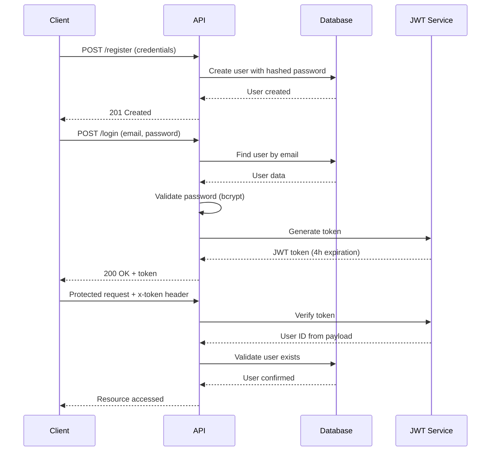

The Clínica Vitalis system implements a secure JWT (JSON Web Token) based authentication mechanism with role-based access control. This system ensures that only authenticated users can access protected resources, while administrative functions are restricted to users with admin privileges.

## Architecture

The authentication system consists of three main components:

<Steps>
  <Step title="User Registration">
    New users register with their credentials. The system hashes passwords using bcrypt and assigns default user roles.
  </Step>
  
  <Step title="Login & Token Generation">
    Users authenticate with email and password. Upon successful validation, the system generates a JWT token with a 4-hour expiration.
  </Step>
  
  <Step title="Token Validation">
    Protected routes use middleware to validate the JWT token and verify user permissions before granting access.
  </Step>
</Steps>

## Authentication Flow



## Key Features

### Secure Password Storage

Passwords are never stored in plain text. The system uses bcrypt with salt generation:

```typescript backend/controllers/auth.ts
const salt = bycryptjs.genSaltSync();
user.password = bycryptjs.hashSync(password, salt);
```

### Token-Based Sessions

JWT tokens eliminate the need for server-side session storage. Each token contains the user ID and expires after 4 hours:

```typescript backend/helpers/generateJWT.ts
jwt.sign(
    { id },
    process.env.KEY_SECRET as string,
    { expiresIn: "4h" },
    (err, token) => {
        // Token generation callback
    }
)
```

### Role-Based Access Control

The system supports two roles:

- **User (`50yunUs3r`)**: Default role with standard access
- **Admin (`50yun4dmin`)**: Elevated privileges for administrative functions

<Warning>
  Admin privileges are granted during registration only when the `admin-key` header matches the `KEY_FOR_ADMIN` environment variable. Protect this key carefully.
</Warning>

## Environment Variables

The authentication system requires these environment variables:

| Variable | Purpose | Example |
|----------|---------|--------|
| `KEY_SECRET` | JWT signing secret | Complex random string |
| `KEY_FOR_ADMIN` | Admin registration key | Secure passphrase |

<Warning>
  Never commit environment variables to version control. Use `.env` files locally and secure secret management in production.
</Warning>

## API Endpoints

### Registration

```http
POST /auth/register
Content-Type: application/json

{
  "name": "Juan",
  "surname": "Pérez",
  "email": "juan.perez@example.com",
  "password": "securePassword123"
}
```

**Admin Registration:**
```http
POST /auth/register
Content-Type: application/json
admin-key: your-secret-admin-key

{
  "name": "Admin",
  "surname": "User",
  "email": "admin@clinica.com",
  "password": "adminPassword123"
}
```

### Login

```http
POST /auth/login
Content-Type: application/json

{
  "email": "juan.perez@example.com",
  "password": "securePassword123"
}
```

**Response:**
```json
{
  "name": "Juan",
  "surname": "Pérez",
  "email": "juan.perez@example.com",
  "rol": "50yunUs3r",
  "token": "eyJhbGciOiJIUzI1NiIsInR5cCI6IkpXVCJ9..."
}
```

## Next Steps

<CardGroup cols={2}>
  <Card title="User Management" icon="users" href="/auth/user-management">
    Learn about user roles and permissions
  </Card>
  
  <Card title="JWT Tokens" icon="key" href="/auth/jwt-tokens">
    Deep dive into token implementation
  </Card>
</CardGroup>
