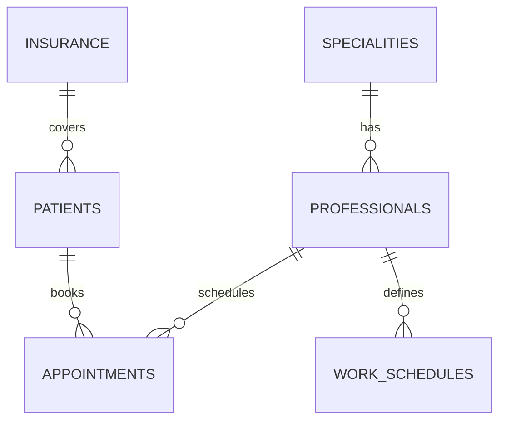

# Platform Features

Clínica Vitalis provides a complete suite of tools for healthcare facility management. Explore all the capabilities designed to streamline your operations.

## Core Features

<CardGroup cols={2}>
  <Card title="Professional Management" icon="user-doctor" href="#professional-management">
    Manage medical staff, specialties, and credentials
  </Card>
  <Card title="Patient Management" icon="hospital-user" href="#patient-management">
    Handle patient records and insurance information
  </Card>
  <Card title="Appointment Scheduling" icon="calendar-check" href="#appointment-scheduling">
    Intelligent scheduling with conflict detection
  </Card>
  <Card title="Work Schedules" icon="clock" href="#work-schedules">
    Coordinate staff availability and working hours
  </Card>
  <Card title="Specialty Management" icon="stethoscope" href="#specialty-management">
    Organize medical specialties and departments
  </Card>
  <Card title="Insurance Management" icon="shield-halved" href="#insurance-management">
    Track insurance providers (Obras Sociales)
  </Card>
</CardGroup>

---

## Professional Management

Comprehensive tools for managing your medical staff with full CRUD operations and advanced filtering.

### Key Capabilities

- **Complete Staff Profiles**: Store detailed information for each professional including personal data, contact information, and specialty
- **Specialty Assignment**: Link professionals to their medical specialties
- **Status Tracking**: Monitor staff status (active/inactive)
- **Data Validation**: Enforce unique DNI and email validation

### Data Model

Each professional record includes:

```typescript
interface IProfessionals {
  id: number;
  name: string;
  surname: string;
  dni: number;              // Unique identifier
  birthdate: Date;
  gender: string;
  address: string;
  phone: string;
  email: string;            // Validated email format
  specialityID: number;     // Foreign key to Specialties
  state?: string;           // Active/Inactive status
}
```

### API Endpoints

| Method | Endpoint | Description | Auth Required |
|--------|----------|-------------|---------------|
| `GET` | `/professionals` | List all professionals | JWT |
| `GET` | `/professionals/:id` | Get professional by ID | JWT |
| `POST` | `/professionals` | Create new professional | JWT + Admin |
| `PATCH` | `/professionals/:id` | Update professional | JWT + Admin |

<Note>
All professional creation and updates require admin privileges and undergo comprehensive validation including DNI uniqueness checks.
</Note>

---

## Patient Management

Efficient patient record management with insurance tracking and comprehensive validation.

### Key Capabilities

- **Patient Registry**: Maintain complete patient records with personal and medical information
- **Insurance Integration**: Link patients to their insurance providers (Obras Sociales)
- **Status Management**: Track patient status (active/inactive)
- **Duplicate Prevention**: Enforce unique DNI validation

### Data Model

```typescript
interface IPatients {
  id: number;
  name: string;
  surname: string;
  dni: number;              // Unique identifier
  birthdate: Date;
  gender: string;
  address: string;
  phone: string;
  email: string;
  socialWorkId: number;     // Foreign key to Insurance Providers
  state?: string;           // Active/Inactive status
}
```

### API Endpoints

| Method | Endpoint | Description | Auth Required |
|--------|----------|-------------|---------------|
| `GET` | `/patients` | List all patients | JWT |
| `GET` | `/patients/:id` | Get patient by ID | JWT |
| `POST` | `/patients` | Create new patient | JWT + Admin |
| `PATCH` | `/patients/:id` | Update patient | JWT + Admin |

### Validation Rules

- **DNI**: Minimum 7 characters, must be unique
- **Phone**: 10-20 characters, numbers/spaces/hyphens only
- **Email**: Must be valid email format
- **Insurance**: Must reference valid insurance provider

---

## Appointment Scheduling

Intelligent appointment system with automatic conflict detection and schedule validation.

### Key Capabilities

- **Smart Scheduling**: Automatic conflict detection for both patients and professionals
- **Schedule Validation**: Ensures appointments fall within professional working hours
- **Double-Booking Prevention**: Unique constraints prevent scheduling conflicts
- **Status Tracking**: Monitor appointment status (pending/confirmed/cancelled)

### Data Model

```typescript
interface IAppointment {
  id: number;
  patientID: number;
  professionalID: number;
  date: string;             // DATEONLY format
  time: string;             // TIME format
  description: string;
  state?: string;           // Appointment status
}
```

### Conflict Prevention

The system enforces two critical unique constraints:

1. **Patient Availability**: One appointment per patient per date/time
2. **Professional Availability**: One appointment per professional per date/time

```typescript
// Automatic database-level constraints
indexes: [
  {
    unique: true,
    fields: ['patientID', 'date', 'time'],
    name: 'unique_appointment_per_patient'
  },
  {
    unique: true,
    fields: ['professionalID', 'date', 'time'],
    name: 'unique_appointment_per_pro'
  }
]
```

### API Endpoints

| Method | Endpoint | Description | Auth Required |
|--------|----------|-------------|---------------|
| `GET` | `/appointments` | List all appointments | JWT |
| `GET` | `/appointments/:id` | Get appointment by ID | JWT |
| `POST` | `/appointments` | Create new appointment | JWT + Admin |
| `PATCH` | `/appointments/:id` | Update appointment | JWT + Admin |

### Validation Workflow

When creating an appointment, the system validates:

1. Patient exists and is available at the requested time
2. Professional exists and is available at the requested time
3. Appointment time falls within professional's work schedule
4. No conflicts with existing appointments

<Warning>
Appointments can only be created during a professional's defined work schedule. Ensure work schedules are configured before booking appointments.
</Warning>

---

## Work Schedules

Coordinate staff availability with flexible work schedule management.

### Key Capabilities

- **Weekly Schedule Definition**: Define work hours for each day of the week
- **Time Range Management**: Set start and end times for each work day
- **Unique Day Constraints**: One schedule entry per professional per day
- **Schedule Validation**: Ensures appointments respect working hours

### Data Model

```typescript
interface IWorkSchedule {
  id: number;
  professionalID: number;
  dayOfWeek: number;        // 0-6 (Sunday to Saturday)
  startTime: string;        // TIME format
  endTime: string;          // TIME format
}
```

### Example Usage

Configure a professional's work schedule:

```json
// Monday schedule
{
  "professionalID": 1,
  "dayOfWeek": 1,
  "startTime": "09:00:00",
  "endTime": "17:00:00"
}
```

### API Endpoints

| Method | Endpoint | Description | Auth Required |
|--------|----------|-------------|---------------|
| `GET` | `/work_schedules` | List all schedules | JWT |
| `POST` | `/work_schedules` | Create schedule entry | JWT + Admin |
| `PATCH` | `/work_schedules/:id` | Update schedule | JWT + Admin |

<Note>
Day of week uses ISO format: 0 = Sunday, 1 = Monday, ..., 6 = Saturday
</Note>

---

## Specialty Management

Organize medical departments and specialties for proper staff categorization.

### Key Capabilities

- **Specialty Catalog**: Maintain a comprehensive list of medical specialties
- **Staff Assignment**: Link professionals to their respective specialties
- **Hierarchical Organization**: Organize healthcare services by specialty

### API Endpoints

| Method | Endpoint | Description | Auth Required |
|--------|----------|-------------|---------------|
| `GET` | `/specialities` | List all specialties | JWT |
| `POST` | `/specialities` | Create new specialty | JWT + Admin |
| `PATCH` | `/specialities/:id` | Update specialty | JWT + Admin |

### Common Specialties

Examples of medical specialties you can manage:
- Cardiology
- Pediatrics
- General Medicine
- Surgery
- Psychiatry
- Dermatology
- And more...

---

## Insurance Management

Track and manage insurance providers (Obras Sociales) for patient coverage.

### Key Capabilities

- **Provider Registry**: Maintain database of insurance providers
- **Patient Coverage**: Link patients to their insurance plans
- **Coverage Validation**: Ensure patients have valid insurance before appointment creation

### API Endpoints

| Method | Endpoint | Description | Auth Required |
|--------|----------|-------------|---------------|
| `GET` | `/socials_works` | List all insurance providers | JWT |
| `POST` | `/socials_works` | Create new provider | JWT + Admin |
| `PATCH` | `/socials_works/:id` | Update provider | JWT + Admin |

---

## Security & Authentication

Robust security features to protect sensitive healthcare data.

### Authentication System

- **JWT-Based Auth**: Secure token-based authentication
- **Password Hashing**: bcryptjs for secure password storage
- **Role-Based Access**: Admin and user role differentiation

### Registration

```typescript
POST /auth/register
{
  "name": "string",
  "surname": "string",
  "email": "string",      // Must be unique and valid
  "password": "string"    // Minimum 6 characters
}
```

### Login

```typescript
POST /auth/login
{
  "email": "string",
  "password": "string"
}

// Returns:
{
  "token": "jwt-token-here",
  "user": {
    "id": 1,
    "name": "User Name",
    "email": "user@example.com"
  }
}
```

### Authorization Levels

<Tabs>
  <Tab title="User Role">
    - View professionals
    - View patients
    - View appointments
    - View schedules and specialties
  </Tab>
  <Tab title="Admin Role">
    All user permissions plus:
    - Create/Update professionals
    - Create/Update patients
    - Create/Update appointments
    - Manage work schedules
    - Manage specialties and insurance providers
  </Tab>
</Tabs>

---

## Data Validation

Comprehensive validation ensures data integrity across the platform.

### Input Validation

All endpoints use `express-validator` for robust validation:

- **Required Fields**: Ensures all mandatory fields are provided
- **Format Validation**: Email, phone, and date format checking
- **Length Validation**: DNI, password, and phone length requirements
- **Custom Validation**: Database uniqueness checks and business logic validation

### Example: Professional Validation

```typescript
// Creating a professional requires:
check("name", "Name is required").not().isEmpty()
check("dni", "DNI must be at least 7 characters").isLength({min: 7})
check("dni").custom(existDNIProfessional)  // Uniqueness check
check("email", "Invalid email format").isEmail()
check("phone")
  .isLength({ min: 10, max: 20 })
  .matches(/^[0-9\s\-\+]*$/)
check("specialityID").custom(existSpecialityById)  // Foreign key validation
```

---

## Database Architecture

Clínica Vitalis uses a relational database model with Sequelize ORM.

### Entity Relationships



### Key Relationships

- **Many-to-Many**: Professionals ↔ Patients (through Appointments)
- **One-to-Many**: Insurance Provider → Patients
- **One-to-Many**: Professional → Appointments
- **One-to-Many**: Patient → Appointments
- **One-to-Many**: Specialty → Professionals
- **One-to-Many**: Professional → Work Schedules

<Note>
All relationships are enforced at the database level with foreign key constraints, ensuring referential integrity.
</Note>

---

## Intelligent Filtering

Advanced filtering capabilities across all resources.

### Filter Options

The platform supports filtering by:
- **Name/Surname**: Search by professional or patient name
- **DNI**: Unique identifier lookup
- **Specialty**: Filter professionals by medical specialty
- **Insurance**: Filter patients by insurance provider
- **Status**: Filter by active/inactive status
- **Date Range**: Filter appointments by date
- **Professional/Patient**: View appointments by staff or patient

### Usage Example

```typescript
// Filter professionals by specialty
GET /professionals?specialityID=1

// Filter appointments by date range
GET /appointments?startDate=2024-01-01&endDate=2024-01-31

// Search patients by name
GET /patients?search=John
```

---

## Technology Highlights

### Frontend Stack

Built with modern React and TypeScript:

```json
{
  "react": "^19.2.0",
  "typescript": "~5.9.3",
  "@reduxjs/toolkit": "^2.11.0",
  "@mui/material": "^7.3.6",
  "react-router-dom": "^6.30.2",
  "react-hook-form": "^7.66.1"
}
```

### Backend Stack

Robust Node.js backend with TypeScript:

```json
{
  "express": "^5.1.0",
  "sequelize": "^6.37.7",
  "sqlite3": "^5.1.7",
  "jsonwebtoken": "^9.0.2",
  "bcryptjs": "^3.0.3",
  "express-validator": "^7.3.1"
}
```

---

## Next Steps

<CardGroup cols={2}>
  <Card title="API Reference" icon="code" href="/api/auth/register">
    Explore detailed API documentation
  </Card>
  <Card title="Database Schema" icon="database" href="/deployment/database-setup">
    Learn about the data models
  </Card>
  <Card title="Authentication Guide" icon="lock" href="/auth/overview">
    Implement secure authentication
  </Card>
  <Card title="Deployment Guide" icon="rocket" href="/deployment/installation">
    Learn how to deploy the platform
  </Card>
</CardGroup>
